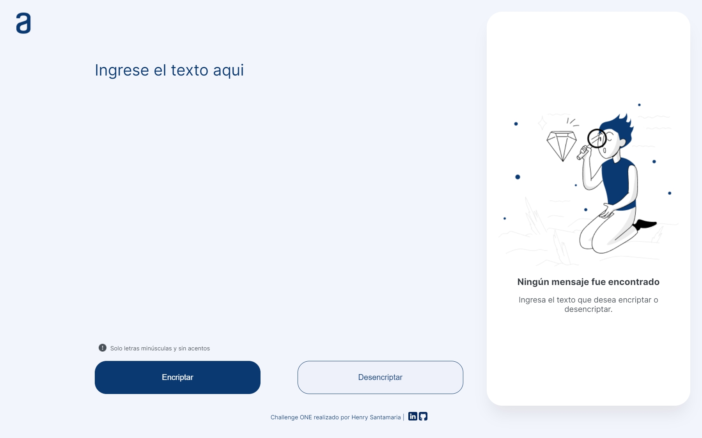
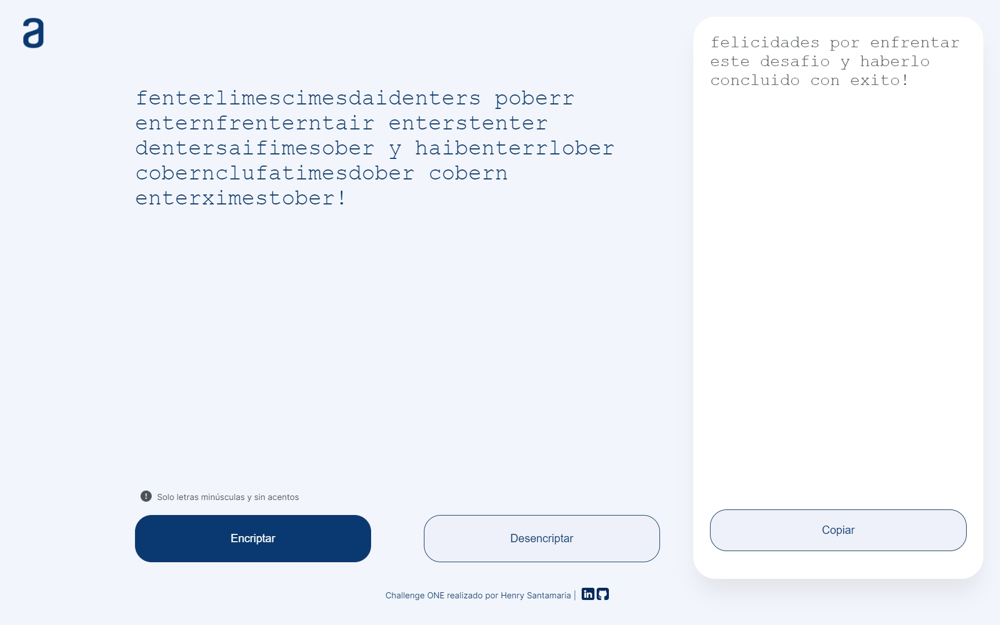
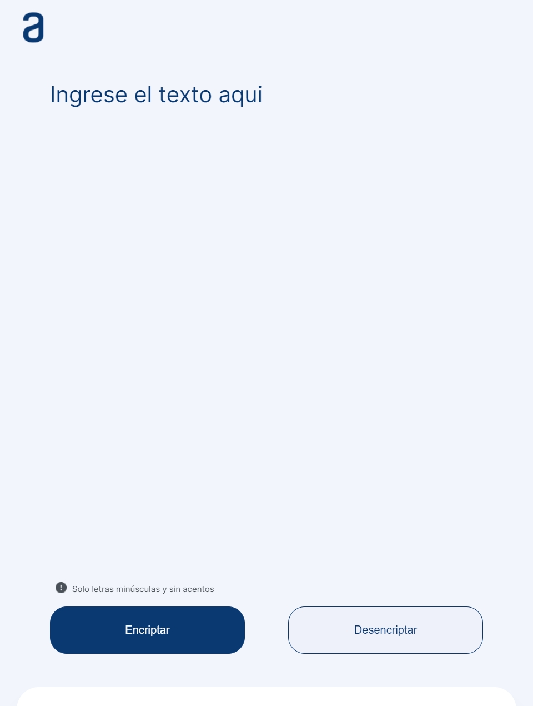
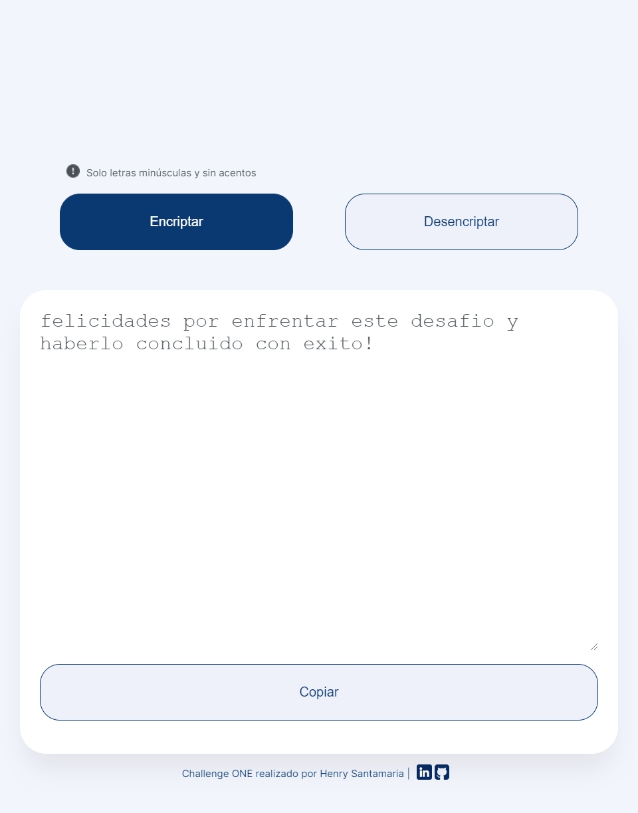
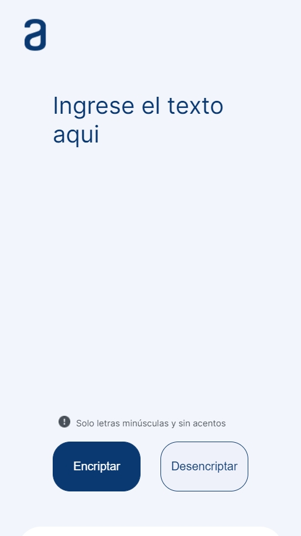
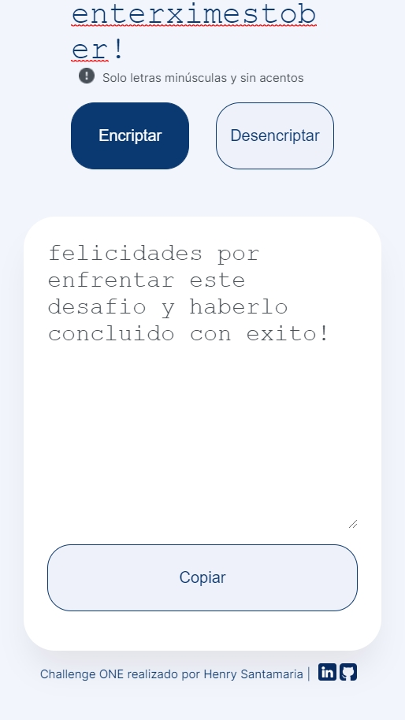

# Programa Oracle ONE Challenge 01
Este repositorio de GitHub almacena un proyecto que forma parte del programa ONE de Oracle y Alura. Se trata de un reto de programación destinado a principiantes que buscan poner en práctica lo aprendido en los cursos de programación.

## Objetivo
El objetivo de este proyecto es poner en práctica los conocimientos adquiridos en los cursos de programación para principiantes ofrecidos por Oracle en conjunto con Alura.

## Descripción del proyecto
El proyecto consiste en una interfaz que permite al usuario encriptar el texto que ingresa. El usuario debe ingresar el texto que desea encriptar y luego presionar un botón para que la interfaz realice la encriptación. Una vez que se completa la encriptación, se muestra el resultado en la pantalla.

## Tecnologías utilizadas
- HTML
- CSS
- JavaScript
- Git

## Capturas 

### Desktop
Screen 01 | Screen 02
--- | ---
 | 

### Tablet
Screen 01 | Screen 02
--- | ---
 | 

### Mobile
Screen 01 | Screen 02
--- | ---
 | 